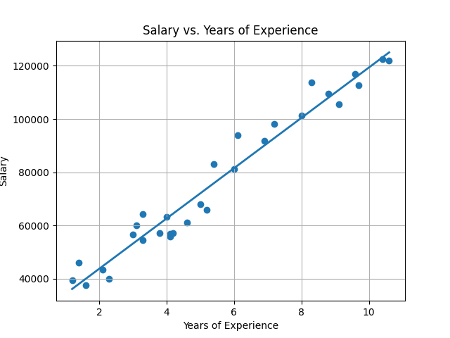
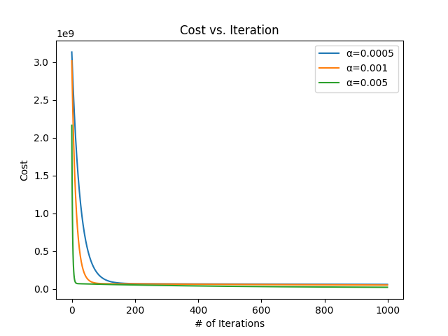

# Linear Regression: Salary Prediction

This project implements linear regression to predict salary based on years of experience. It demonstrates two approaches for finding the optimal regression line:
1.  **Closed-Form Solution:** Directly calculates the slope and intercept using mathematical formulas.
2.  **Gradient Descent:** An iterative optimization algorithm to find the slope and intercept by minimizing a cost function.

The project also visualizes the dataset, the fitted regression line, and the convergence of the gradient descent algorithm for different learning rates.

## Features

*   Loads data from a CSV file (`Salary_dataset.csv`).
*   Implements linear regression using the closed-form (Normal Equation equivalent for simple linear regression) method.
*   Implements linear regression using the gradient descent algorithm.
*   Calculates and compares the Root Mean Squared Error (RMSE) for both methods.
*   Visualizes the original data points and the regression line from the closed-form solution.
*   Visualizes the cost function's decrease over iterations for different learning rates in gradient descent.

## Dataset

The project uses the `Salary_dataset.csv` file located in the `data/` directory.
*   **YearsExperience**: Independent variable (feature).
*   **Salary**: Dependent variable (target).

## Technologies Used

*   Python 3.x
*   NumPy: For numerical operations and array manipulation.
*   Pandas: For data loading and manipulation (DataFrame).
*   Matplotlib: For plotting graphs.

## Project Structure

.\
├── data/\
│ └── Salary_dataset.csv    
├── images/\
│ ├── salary_vs_experience_plot.png\
│ └── cost_vs_iteration_plot.png\
├── main.py\
└── README.md

## Setup and Installation

1.  **Clone the repository (if applicable) or download the files.**
2.  **Ensure Python 3 is installed.**
3.  **Install the required libraries:**
    ```bash
    pip install numpy pandas matplotlib
    ```
    If you are using a virtual environment (recommended):
    ```bash
    python -m venv venv
    source venv/bin/activate  # On Windows: venv\Scripts\activate
    pip install numpy pandas matplotlib
    ```
4.  **Place `Salary_dataset.csv` inside a `data` subdirectory** relative to `main.py`.

## How to Run

1.  Navigate to the project's root directory in your terminal.
2.  Execute the Python script:
    ```bash
    python main.py
    ```

## Output

The script will:
1.  Print the calculated slope and intercept from both Gradient Descent (GD) and Closed-Form (CF) methods.
2.  Print the Root Mean Squared Error (RMSE) for both methods.
3.  Print the contents of the DataFrame.
4.  Display two Matplotlib plots in separate windows:
    *   **Salary vs. Years of Experience:** A scatter plot of the data points with the fitted regression line.
        *   **Action Required:** Save this plot as `images/salary_vs_experience_plot.png`.

        

    *   **Cost vs. Iteration:** Shows how the cost function decreases over iterations for different learning rates (alpha values) during gradient descent.
        *   **Action Required:** Save this plot as `images/cost_vs_iteration_plot.png`.

        

**Example Console Output (values may vary slightly based on library versions or minor code changes):**

GD slope: 9449.96, GD intercept: 24848.20
CF slope: 9449.96, CF intercept: 24848.20
Predictions: [ 36188.1587522 38078.15121651 35243.16173403 40913.14072492
39968.14370675 53197.10134095 54142.10034968 56032.09281399
56032.09281399 60717.07708553 62607.06954983 63552.06855856
63552.06855856 64318.06781373 68058.0550671 72743.03933864
74633.03180295 76523.02426726 81208.00853879 82153.00754752
89737.98374751 92572.97522044 99212.95240224 102047.94387517
106732.9281467 109567.91961963 114252.90389117 115197.9028999
120827.88519487 122717.87765918]
Closed-form RMSE: 5592.043608760662
Gradient Descent RMSE: 5592.043608760662
--- DataFrame ---
YearsExperience Salary
1.2 39344.0
1.4 46206.0
1.6 37732.0
2.1 43526.0
2.3 39892.0
3.0 56643.0
3.1 60151.0
3.3 54446.0
3.3 64446.0
3.8 57190.0
4.0 63219.0
4.1 55795.0
4.1 56958.0
4.2 57082.0
4.6 61112.0
5.0 67939.0
5.2 66030.0
5.4 83089.0
6.0 81364.0
6.1 93941.0
6.9 91739.0
7.2 98274.0
8.0 101303.0
8.3 113813.0
8.8 109432.0
9.1 105583.0
9.6 116970.0
9.7 112636.0
10.4 122392.0
10.6 121873.0

## Code Overview

*   **`linear_regression(x, y)`**: Calculates slope (`m`) and intercept (`b`) using the closed-form solution.
*   **`predict(x, m, b)`**: Predicts `y` values given `x`, `m`, and `b`.
*   **`rmse(y_true, y_pred)`**: Calculates the Root Mean Squared Error.
*   **`cost(m, b, x, y)`**: Calculates the cost (mean squared error / 2) for gradient descent.
*   **`partiald_m(m, b, x, y)`**: Calculates the partial derivative of the cost function with respect to `m`.
*   **`partiald_b(m, b, x, y)`**: Calculates the partial derivative of the cost function with respect to `b`.
*   **`descent(alpha, m, b, x, y, iterations)`**: Performs gradient descent to find optimal `m` and `b`, returning the final parameters and a history of costs.

The main part of the script then uses these functions to:
1.  Initialize parameters for gradient descent.
2.  Run gradient descent.
3.  Calculate parameters using the closed-form solution.
4.  Make predictions and calculate RMSE for both methods.
5.  Generate and display the plots.